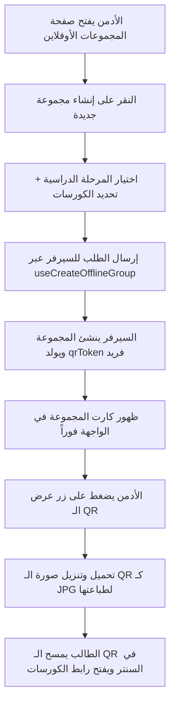

# 📚 دليل وتوثيق نظام المجموعات الأوفلاين (Offline Groups Management)

---

## 🎯 1. نظرة عامة والهدف من الميزة (Overview & Purpose)

تم تصميم نظام **المجموعات الأوفلاين (Offline Groups)** لربط المحتوى الرقمي للمنصة (الكورسات والمراحل الدراسية) بالفصول والقاعات الدراسية الحضورية (Offline Classrooms/Centers).

### 💡 آلية العمل باختصار:
1. يقوم مسؤول النظام (Admin) بإنشاء **مجموعة أوفلاين جديدة** واختيار:
   - **المرحلة الدراسية (Stage)**.
   - **الكورسات المرتبطة بتلك المجموعة (Courses)**.
2. يقوم النظام تلقائياً بتوليد **رمز استجابة سريعة فريد (Unique QR Code & Token)** لكل مجموعة.
3. يقوم المسؤول بتحميل وتنزيل رمز الـ QR وطباعته أو عرضه داخل السنتر/القاعة الدراسية.
4. عندما يقوم الطالب بمسح الـ QR بكاميرا هاتفه، يتم توجيهه إلى صفحة الوصول الأوفلاين (`/offline-page?token=...`) وتفعيل الكورسات المرتبطة بالمجموعة لحسابه تلقائياً.

---

## 📁 2. الهيكل البرمجي للملفات (File Structure)

تم تنظيم المشروع باتباع أفضل ممارسات وهندسة الكود في React و TypeScript:

```
src/
├── types/
│   └── offlineGroup.ts                          # تعريف الأنواع وواجهات البيانات (Interfaces & Types)
├── features/
│   └── admin/
│       ├── services/
│       │   └── offlineServices.ts               # دوال الاتصال بالـ API مع السيرفر
│       ├── hooks/
│       │   └── useOffline.ts                    # خطافات React Query لإدارة الكاش والحالة
│       └── pages/
│           └── OfflineGroups.tsx                # واجهة المستخدم الرئيسية وإدارة المجموعات
├── pages/
│   └── AdminDashboard/
│       ├── adminDashboardRoutes.tsx             # مسار الصفحة في الداشبورد (/admin-dashboard/offline)
│       └── AdminSidebar.tsx                     # إضافة التبويب في القائمة الجانبية
└── locales/
    ├── ar.json                                  # الترجمة العربية
    └── en.json                                  # الترجمة الإنجليزية
```

---

## 🔍 3. الشرح التفصيلي للملفات (Detailed File Breakdown)

### أ) ملف الأنواع: `src/types/offlineGroup.ts`
يحتوي على العقود (Contracts) لبيانات المجموعات القادمة من وإلى السيرفر:

- `OfflineGroup`: يمثل كائن المجموعة الواحدة، ويحتوي على:
  - `id`: المعرف الفريد للمجموعة.
  - `qrToken`: التوكن المشفر الخاص بالـ QR Code.
  - `stageId` & `stage`: بيانات المرحلة الأكاديمية (الاسم بالعربي والإنجليزي، المعرف، إلخ).
  - `courses`: مصفوفة الكورسات المربوطة بالمجموعة.
  - `createdAt`: تاريخ إنشاء المجموعة.
- `CreateOfflineGroupPayload`: نوع البيانات المرسلة عند إنشاء مجموعة:
  - `stageId: string`
  - `courseIds: string[]`
- `OfflineGroupsResponse` / `OfflineGroupResponse`: استجابة الـ API الرسمية مع مصفوفة البيانات ومعلومات الـ Pagination.

---

### ب) طبقة الخدمات: `src/features/admin/services/offlineServices.ts`
تستخدم مكتبة `axios` المجهزة بالمشروع للتعامل مع الـ Endpoints التالية:

| الدالة | نوع الطلب (Method) | المسار (Endpoint) | الوصف |
| :--- | :--- | :--- | :--- |
| `getOfflineGroups()` | `GET` | `/offline-groups` | جلب كافة المجموعات الأوفلاين |
| `getOfflineGroup(id)` | `GET` | `/offline-groups/:id` | جلب تفاصيل مجموعة محددة |
| `createOfflineGroup(data)` | `POST` | `/offline-groups` | إنشاء مجموعة جديدة وربطها بالكورسات |
| `updateOfflineGroup(id, data)` | `PATCH` | `/offline-groups/:id` | تحديث بيانات مجموعة |
| `deleteOfflineGroup(id)` | `DELETE` | `/offline-groups/:id` | حذف مجموعة نهائياً |

---

### ج) طبقة إدارة الحالة: `src/features/admin/hooks/useOffline.ts`
تعتمد على `@tanstack/react-query` لضمان سرعة الاستجابة، التخزين المؤقت الذكي، وتحديث الواجهة تلقائياً:

- **`useGetOfflineGroups`**:
  - يقوم بجلب المجموعات وحفظها في الكاش تحت المفتاح `['offlineGroups']`.
- **`useCreateOfflineGroup`**:
  - إرسال طلب إنشاء مجموعة جديدة.
  - في حالة النجاح: يقوم بعمل `invalidateQueries` لتحديث الجدول والكروت فوراً، ويظهر رسالة نجاح عبر `ErrorService.success`.
  - في حالة الخطأ: يعالج رسالة الخطأ عبر `ErrorService.handleError`.
- **`useUpdateOfflineGroup`**:
  - لتعديل المجموعات وتحديث الكاش تلقائياً.
- **`useDeleteOfflineGroup`**:
  - لحذف المجموعة من السيرفر وإزالتها من الواجهة فوراً مع إشعار بالنجاح.

---

### د) واجهة المستخدم: `src/features/admin/pages/OfflineGroups.tsx`
صفحة متكاملة وحديثة تشمل كافة متطلبات الإدارة:

#### 1. بطاقات الإحصائيات (Stats Cards):
- عداد فوري لإجمالي عدد المجموعات الأوفلاين المنشأة.
- عداد للمراحل الدراسية المتوفرة.

#### 2. شريط البحث والفلترة (Real-time Filter):
- إمكانية كتابة اسم المرحلة (سواء بالعربية أو الإنجليزية) أو كتابة رقم معرف المجموعة (ID) لتصفية النتائج فورياً دون الحاجة لإعادة تحميل الصفحة.

#### 3. شبكة عرض المجموعات (Groups Grid):
- كل بطاقة تعرض:
  - رقم المعرف المختصر (`ID: #...`).
  - اسم المرحلة الدراسية بخط واضح.
  - تاريخ الإنشاء وعدد الكورسات المربوطة.
  - شارات (Badges) مصغرة بأسماء الكورسات التابعة للمجموعة.
  - زر عرض رمز الـ QR Code.
  - زر حذف المجموعة.
- دعم حالات التحميل التفاعلي (Skeleton Shimmer).
- تصميم أنيق لشاشة عدم وجود نتائج (Empty State).

#### 4. مودال إنشاء مجموعة (Create Group Modal):
- اختيار المرحلة الدراسية من قائمة منسدلة مسترجعة ديناميكياً من `useGetAllStages()`.
- اختيار متعدد للكورسات (Multi-Select Checkboxes) مسترجعة من `useCourses()`.
- التحقق من إدخال مرحلة واحدة على الأقل واختيار كورس واحد قبل تفعيل زر الحفظ.

#### 5. مودال عرض وتنزيل الـ QR Code (QR Code Modal & Downloader):
- توليد الـ QR Code مباشرة على المتصفح بجودة عالية (`level="H"`) باستخدام مكتبة `qrcode.react`.
- يقوم الرمز بتوجيه الطالب إلى الرابط المباشر:
  ```text
  https://yourdomain.com/offline-page?token={qrToken}
  ```
- **خاصية التنزيل الفوري (JPG / PNG)**:
  - رسم الـ QR Code على عنصر `HTML Canvas` وإضافة حواف بيضاء مريحة للطباعة (`padding`).
  - تنزيل الصورة فوراً على جهاز الأدمن باسم المجموعة: `QR-OfflineGroup-xxxxxxxx.jpg`.

#### 6. مودال تأكيد الحذف (Delete Confirmation Modal):
- استخدام `ConfirmModal` الموحد لحماية البيانات من الحذف غير المقصود.

---

## 🌐 4. التوجيه واللغات (Routing & Localization)

1. **الراوت (Routing)**:
   - تم تسجيل المسار الفرعي في `adminDashboardRoutes.tsx`:
     - المسار: `/offline`
     - الأيقونة: `QrCode`
2. **الترجمة (i18n)**:
   - ملف `src/locales/ar.json`: تم تضمين كافة النصوص العربية بدقة (العناوين، الرسائل التنبيهية، نصوص الأزرار، وحقول الإدخال).
   - ملف `src/locales/en.json`: تم تضمين الترجمات الإنجليزية المناظرة.
   - الصفحة تدعم التبديل اللحظي بين العربية (`rtl`) والإنجليزية (`ltr`).

---

## 🚀 5. مخطط تدفق العمليات (Workflow Diagram)



---

## 📌 6. ملخص الميزات والمزايا التقنية المطبقة:
✔️ **TypeScript بالكامل**: تجنب الأخطاء مع Typesafe Interfaces دقيقة.  
✔️ **React Query Caching**: أداء عالي وتحديث تلقائي دون Refresh.  
✔️ **Client-Side QR Canvas Generator**: تصدير صور QR عالية الدقة دون الاعتماد على خدمات خارجية.  
✔️ **UI/UX عصري**: تصميم متناسق مع Glassmorphism وظلال وألوان مريحة للعين.  
✔️ **دعم كامل للغتين العربية والإنجليزية (RTL / LTR)**.
